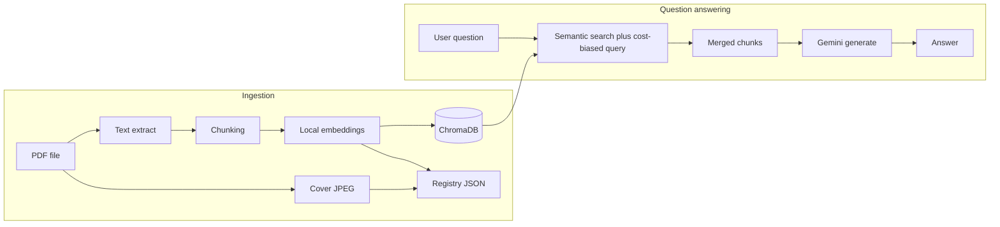

# Board Game Rulez

A local tool for asking natural-language questions about board game rulebooks you provide as PDFs. Answers are grounded in the text of those PDFs using a **Retrieval-Augmented Generation (RAG)** pipeline you run on your own machine, plus the **Google Gemini API** for the final answer. There is **no separate hosted “RAG service”**: embeddings, vector storage, and retrieval are implemented in this repo; only the **generative LLM** call goes to Google.

---

## Is this RAG?

**Yes.** In the usual sense:

1. **Retrieval** — Your question is turned into a vector and used to search a local vector database (Chroma) for the most relevant chunks of rulebook text for the selected game.
2. **Augmentation** — Those chunks are pasted into a prompt as “official rulebook excerpts.”
3. **Generation** — Gemini reads the excerpts and the user question and writes a short answer, instructed to stick to what appears in the excerpts.

So the model does **not** answer from its training memory alone for the factual rule content; it is steered by whatever chunks were retrieved. If retrieval misses the right passage, answers can still be incomplete or wrong—that is the normal RAG tradeoff.

---

## How Chroma works (in this project)

**Chroma** is an open-source **vector database** that runs **locally** on your machine. It is not an LLM and it does not consume API “tokens.” Its job is to store many pieces of text together with **numeric vectors** (embeddings) so you can ask: “which stored texts are most similar to this query?” without reading every character of the rulebook at search time.

### Collections and records

In this repo, ingestion uses a **`PersistentClient`** pointing at `data/chroma_db/`. That directory holds Chroma’s on-disk files (metadata, indices, and stored payloads). All rulebook chunks for every game live in one **collection** named `board_game_rules`.

Each indexed chunk is a **record** with roughly four parts:

1. **`id`** — A stable string (`{game_name}_chunk_{i}`) so the same logical chunk can be updated or deleted (for example, before re-embedding a game).
2. **`document`** — The **actual chunk text** copied from the PDF pipeline. This is what eventually gets pulled into the Gemini prompt as “rulebook excerpts.” Chroma needs the raw text so retrieval can return it; the vector alone is not human-readable.
3. **`embedding`** — A **fixed-length list of floats** produced by the embedding model (see below). Chroma indexes these vectors so **approximate nearest-neighbor** search is fast: compare the query vector to many stored vectors and return the closest ones.
4. **`metadata`** — Small key–value filters. Here we only store `game_name` so a search can be limited to one title (`where={"game_name": "…"}`) and not mix two games’ rules.

### Query flow

When you ask a question, `search_rulebook`:

1. Turns the question into the **same kind of vector** as the chunks (same model, same space).
2. Asks Chroma for the **top-N nearest** chunks **in that vector space**, subject to the `game_name` filter.
3. Returns the **text** of those chunks. Those strings are what get concatenated and sent to Gemini—not the whole PDF, and not the raw float vectors.

So **Chroma’s role** is: **fast semantic lookup** over precomputed vectors, returning a small handful of text passages for the LLM.

### On-disk layout (why you see `chroma.sqlite3`)

In **persistent** mode, Chroma splits work across:

- **`chroma.sqlite3`** — SQLite database holding catalog data, document text, metadata, and related bookkeeping.
- **A UUID-named subfolder** with **`*.bin` files** (e.g. `data_level0.bin`) — the **HNSW** approximate nearest-neighbor index over your embedding vectors.

So it is a **vector database**, not “just SQLite”: SQL stores structured payloads; the **vector search graph** lives in those binary index files.

---

## What sentence-transformer embeddings are doing

A **sentence transformer** (here: **`sentence-transformers/all-MiniLM-L6-v2`**) is a **small neural network** trained so that **short texts** (sentences or paragraphs) map to a **single point in a high-dimensional space** (for this model, vectors are typically **384 numbers**).

### Why that helps search

- Texts that are **semantically similar** (“How do I build a city?” vs a passage about upgrading settlements to cities) tend to land **close together** when you measure distance (Chroma uses **cosine distance** by default for this setup).
- Texts about **unrelated** topics land **far apart**.

So the embedding is a **compressed semantic fingerprint** of the chunk: not English, not tokens for Gemini, but a geometry that supports “find passages that *mean* something like the question.”

### Ingest vs query must match

The **same** model embeds:

- every **rulebook chunk** at ingest time, and  
- the **user question** at query time.

If you mixed two different embedding models, their vectors would live in **incompatible spaces** and similarity search would be meaningless. This project keeps one model end to end.

### Where it runs

Embedding runs **locally** via `sentence-transformers` (PyTorch). The first run may download model weights; after that, CPU (or GPU if available) computes vectors. **No Google API is used for embeddings** in this codebase.

---

## Tokens, disk space, and “not sending the whole PDF”

People often mix up three different ideas: **LLM tokens**, **embedding vectors**, and **files on disk**.

### LLM tokens (Gemini)

**Tokens** are how the **language model** meters input and output: words and subwords are split into tokens, and pricing and context limits are expressed in tokens.

- **Indexing with Chroma does not spend Gemini tokens.** PDF extraction, chunking, and MiniLM embedding are all local steps.
- **Each answer request** sends one prompt to Gemini containing: instructions, the **retrieved chunk texts** (only a subset of the rulebook), and your question. Those chunk strings **are** tokenized by Gemini and count toward **input** context.

The point of RAG is exactly this: **instead of putting the entire rulebook** (perhaps hundreds of thousands of tokens) into every request, you put only **e.g. ~10 merged chunks**—on the order of thousands of characters, not the full PDF. That usually **greatly reduces** input tokens, cost, and the chance of blowing past the model’s context window, compared to “paste the whole book.”

Retrieval is a **deliberate trade**: you save tokens and cost, but if the right paragraph was not in the retrieved set, the model never sees it.

### What is stored on disk (Chroma)

Chroma is **not** storing “tokens” in the LLM sense. It stores:

- **Vectors** — a few hundred floats per chunk (compact compared to storing redundant copies of the full book as one giant string for every query).
- **Chunk text** — the same passages you might send to the model later. Disk use grows with how much text you indexed (many chunks × chunk size). That is normal: you need the text somewhere to inject it into the prompt after search.

So: **local storage** holds enough to map questions → relevant paragraphs. **Token usage** at answer time is driven by **how much of that retrieved text** you append to the prompt (this project caps how many chunks are merged).

### Embeddings vs tokens

Embeddings are **not** a token-efficient serialization of the PDF for Gemini. They are **search keys**. The model never sees the 384 floats; it only sees the human-readable chunk text you retrieved using those keys.

---

## How it works (end to end)

### Ingestion (PDF → searchable index)

1. **Extract text** from the PDF with **PyMuPDF** (`pdf_processor.extract_text`). **Diagrams and images are not indexed**—only text. Answers about purely visual rules may be weak unless the same information appears in writing.
2. **Chunk** the text: paragraphs are normalized, then the stream is split into overlapping character windows (defaults favor keeping rule subsections together). See `ingestion/pdf_processor.py`.
3. **Embed** each chunk with a **local** sentence-transformers model (`all-MiniLM-L6-v2`) via Chroma’s embedding function.
4. **Store** in **ChromaDB** (`data/chroma_db/`, gitignored) in collection `board_game_rules`. Each chunk has metadata `game_name` so searches can be scoped to one title.
5. **Register** the game in **`data/ingestion_registry.json`** (gitignored): display name, **SHA-256** of the PDF, and source filename. This prevents ingesting the **same game name** (case-insensitive) or the **same file bytes** twice.
6. **Cover thumbnail** — Renders **page 1** of the PDF to a small JPEG (`ingestion/thumbnail.py`) under **`data/game_thumbnails/`** (gitignored), linked from the registry. The Flask UI uses this in **library pills**, next to the **Playing** selector, and exposes a **`/game-thumb/...`** route. Games ingested before this feature show a **letter** placeholder until a new thumbnail-creating ingest (same-name re-ingest is blocked by the registry—you would need a deliberate refresh workflow).

The CLI entrypoint is `src/ingest.py`. The Flask UI uploads a PDF and runs the same pipeline through `ingestion/pipeline.py`.

If a Chroma database already exists but the registry file is empty, startup code can **backfill game names from Chroma** so the library list still appears (hashes for dedupe apply once you ingest through the registry-aware path).

### Retrieval (question → context chunks)

Implemented in `retrieval/search.py`:

- The user’s question is embedded with the **same** model as the documents.
- **Two** vector queries run against Chroma, both filtered by `game_name`:
  - The raw user question.
  - The same question plus a fixed string of “building / costs / resources” style terms so passages with **Requires:** lines rank better than generic mentions of “city” or “build.”
- Results are **merged and deduplicated** by chunk ID (up to a cap) and returned as plain text snippets.

This is classic **dense retrieval** (embedding similarity), not a separate Elasticsearch/BM25 service.

### Generation (context → answer)

Implemented in `generation/gemini_client.py`:

- Chunks are joined with separators into one block of context.
- A single prompt instructs Gemini to answer **only** from those excerpts and to quote resource requirements when present.
- The code tries a short list of model IDs (e.g. `gemini-2.5-flash`) and falls back if one errors.

Requires **`GEMINI_API_KEY`** (e.g. in `.env` at the project root).

### Web interfaces

| Entry | Command | Role |
|--------|---------|------|
| **Flask** | `python src/flask_app.py` | Primary UI: responsive layout (mobile-first tweaks), PDF upload with dedupe, **search box + dropdown** to pick a game, **clickable library pills** (same selection as the dropdown), cover previews, scrollable chat panel, **inline “thinking” message in the chat** while Gemini runs. Session-backed chat. |
| **Streamlit** | `streamlit run src/app.py` | Simpler chat UI; same RAG backend; game list from the registry (and Chroma sync). |

Both call `search_rulebook` then `get_answer`.

### One Chroma folder for all games (scaling)

All games share one **Chroma** `PersistentClient` directory and one collection **`board_game_rules`**, with **`game_name`** in metadata so each query only retrieves chunks for the selected title. That keeps backups and code paths simple and is adequate for personal or club-sized libraries. **Embedded Chroma** does not horizontally shard: at very large vector counts or heavy concurrent writes, you would profile and might move to hosted Chroma or another vector store—not because “one collection is wrong,” but because **single-node SQLite + local HNSW** has practical limits.

---

## Architecture (data flow)



---

## Setup

### Requirements

- Python 3.10+ (as used in development)
- A **Gemini API key** for generation

### Install

```bash
cd board_game_rulez
python -m venv venv
source venv/bin/activate   # Windows: venv\Scripts\activate
pip install -r requirements.txt
```

Create **`.env`** in the repo root (same level as `src/`):

```env
GEMINI_API_KEY=your_key_here
```

Optional for Flask sessions in non-local deployments:

```env
FLASK_SECRET_KEY=long_random_string
```

### Ingest a rulebook (CLI)

```bash
python src/ingest.py --pdf /path/to/rules.pdf --game "Exact Game Name"
```

Duplicate **names** or **PDF content** (hash) are rejected with a clear message when using the registry-aware pipeline.

### Run the apps

```bash
# Flask (default http://127.0.0.1:5000)
python src/flask_app.py

# Streamlit
streamlit run src/app.py
```

Upload limits on Flask: **25 MB** per request (see `flask_app.py`).

---

## Repository layout (important paths)

| Path | Purpose |
|------|---------|
| `src/app.py` | Streamlit UI |
| `src/flask_app.py` | Flask UI |
| `src/ingest.py` | CLI ingestion |
| `src/ingestion/` | PDF processing, embedding, registry, thumbnails, `pipeline.py` |
| `src/templates/` / `src/static/` | Flask HTML/CSS/JS |
| `src/retrieval/search.py` | Vector search + merge |
| `src/generation/gemini_client.py` | Prompt + Gemini call |
| `data/chroma_db/` | Local vector store (gitignored) |
| `data/ingestion_registry.json` | Ingested games + hashes (gitignored) |
| `data/game_thumbnails/` | First-page JPEG covers for the Flask UI (gitignored) |
| `data/raw_pdfs/` | Optional local PDF stash (gitignored in this repo) |

---

## Troubleshooting

- **Empty game list** — Ingest at least one PDF, or ensure Chroma contains data and let the app backfill the registry from metadata.
- **Generic or missing rule details** — RAG quality depends on chunks and retrieval; the dual-query merge is meant to surface cost lines; very large or oddly formatted PDFs may still split tables badly.
- **Chroma / PostHog telemetry noise** — `posthog` is pinned in `requirements.txt` to reduce a known telemetry quirk; telemetry is also disabled via env in the apps.

---

## License / data

Rulebook PDFs are your responsibility to obtain and use according to their publishers’ terms. This project only indexes files you supply.
